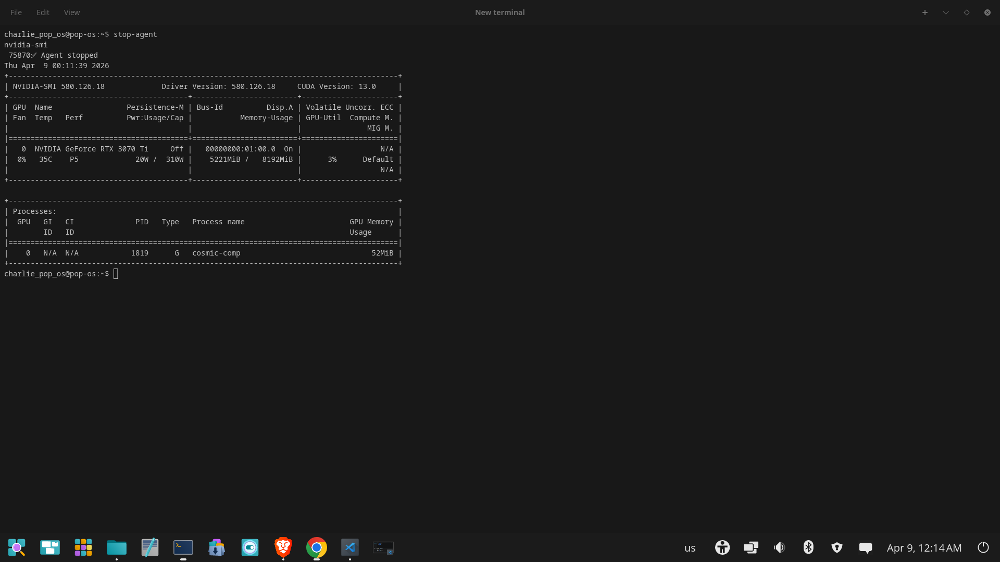
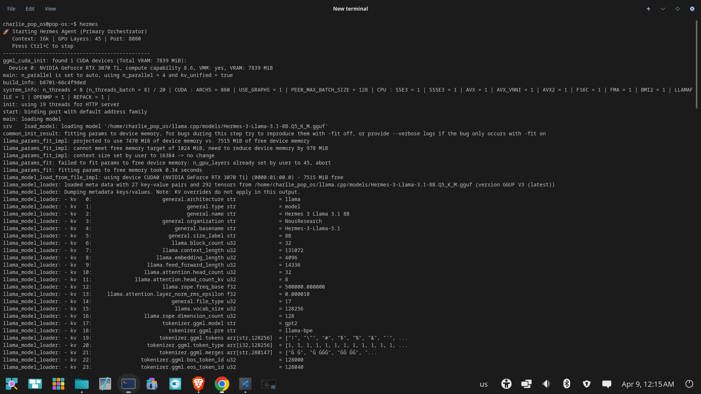
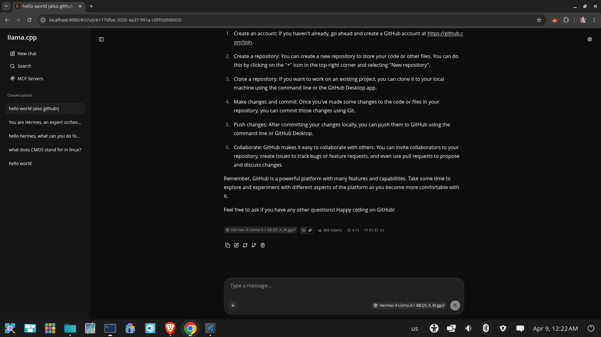
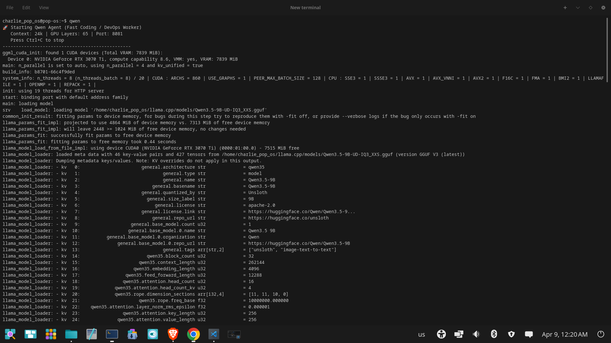
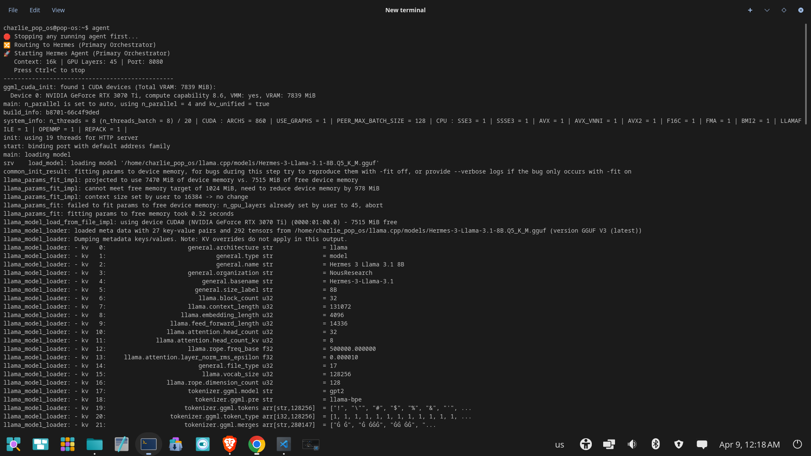
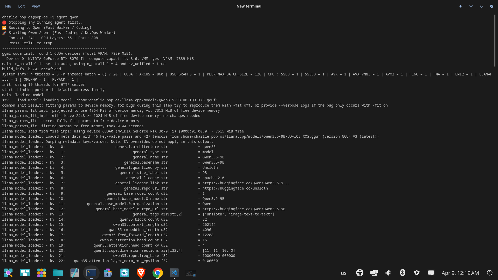
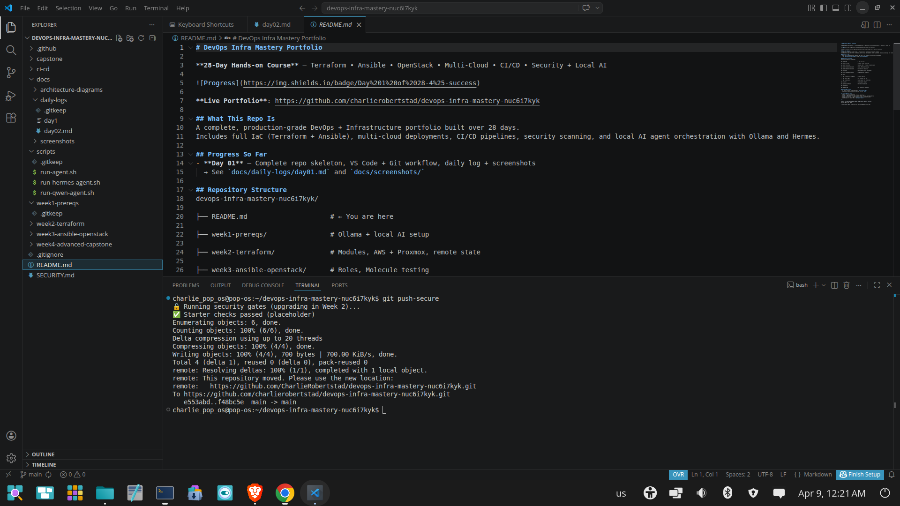

# Day 02 — DevOps Infra Mastery Portfolio

**Date:** April 8, 2026  
**Week:** 1 (Prerequisites & Local AI Setup)  
**Progress:** 2/28 days completed

## What I Accomplished Today
- Successfully dual-booted into native Pop!_OS 24.04 LTS (NVIDIA Edition)
- Installed and verified CUDA 13.2 with full RTX 3070 Ti support
- Set up llama.cpp with CUDA acceleration
- Downloaded and optimized two strong local models:
  - Hermes-3-Llama-3.1-8B (primary orchestration agent)
  - Qwen 3.5 9B (fast coding / DevOps worker)
- Created clean scripts and aliases (`hermes`, `qwen`, `agent`, `stop-agent`)
- Built a lightweight router for easy model switching
- Configured Git and VS Code workflow in Linux (matching Windows setup)

## Key Learnings
- Native Linux gives significantly better GPU performance vs WSL2 for local AI
- On 8 GB VRAM, we must tune context length and GPU layers carefully
- Hermes is excellent as an orchestration/conductor agent
- Qwen 3.5 9B is a strong specialized worker for technical tasks
- Router + aliases make model switching clean and repeatable

## Challenges & How I Solved Them
- Multiple CUDA version conflicts → cleaned up and used full CUDA 13.2 Toolkit
- VRAM out-of-memory errors → adjusted context and GPU layers for each model
- Broken shell config after recovery → recreated clean `.bashrc` and `.bash_aliases`

## Screenshots / Proof

## Tomorrow's Plan (Day 03)
- Continue Week 1 prereqs
- Test Hermes orchestration with real DevOps tasks
- Begin populating `week1-prereqs/`

**Daily Reflection:**  
Today, which actually took a few days to complete, was heavy on infrastructure and AI setup, but I now have a real local agent system running natively on Linux. The performance difference compared to WSL2 is already noticeable. Feeling very motivated for the actual IaC work ahead.

---
*Committed with `git push-secure` on Day 02*