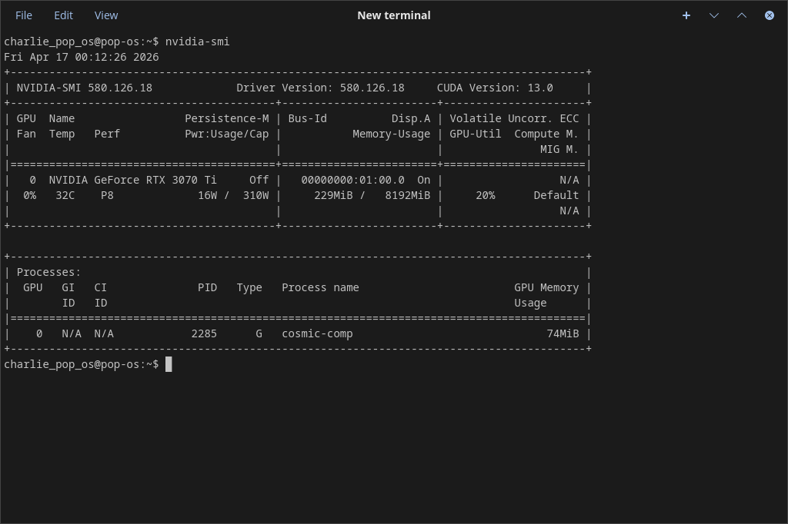
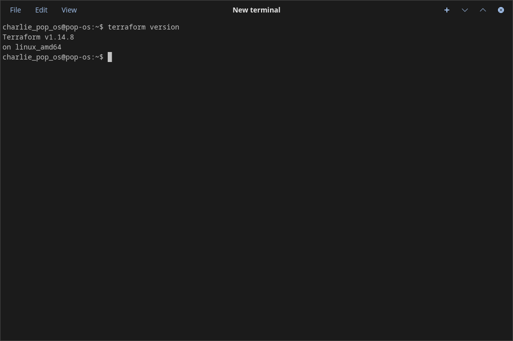
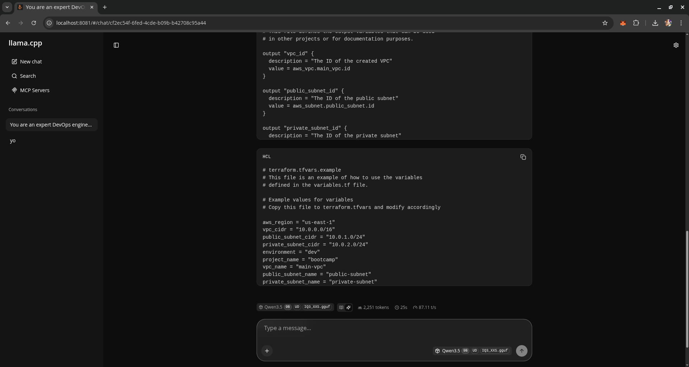
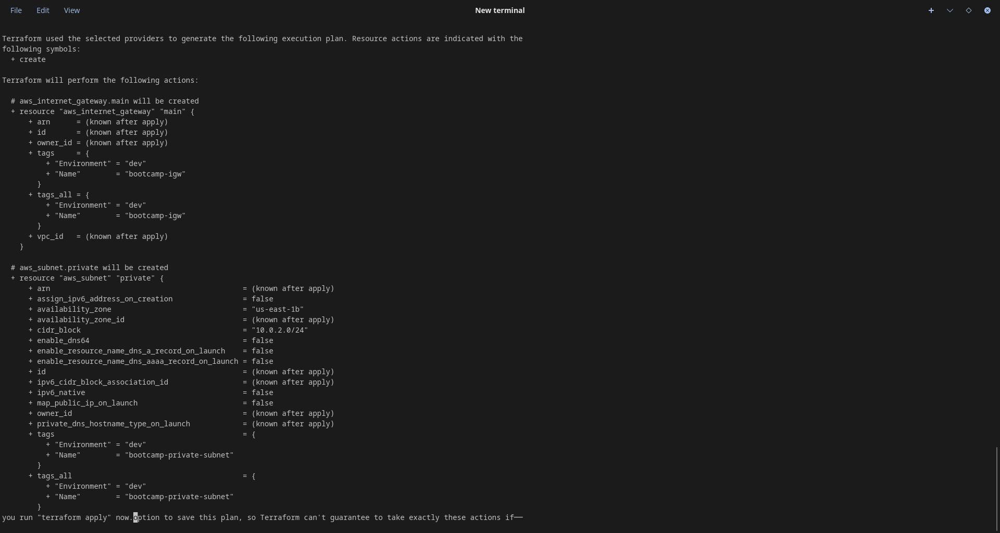
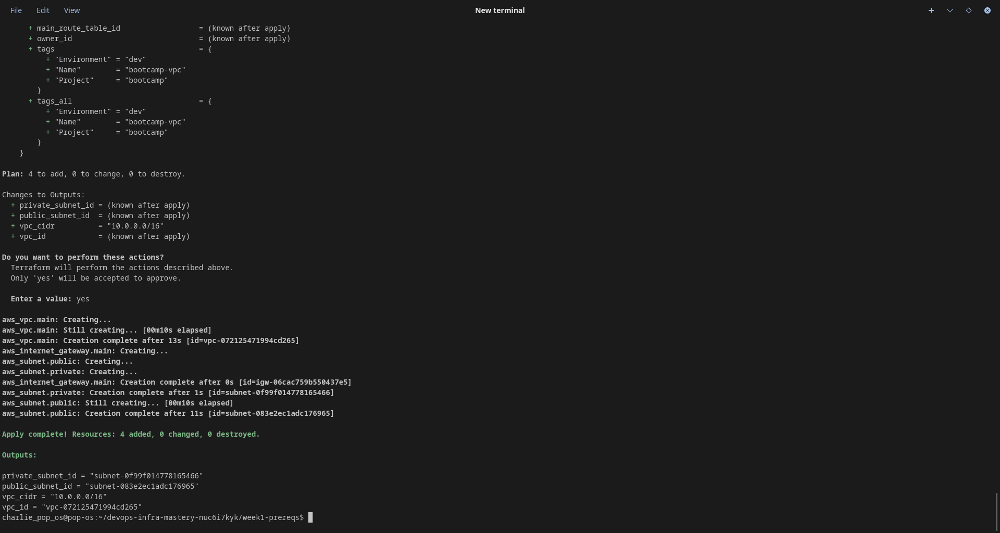
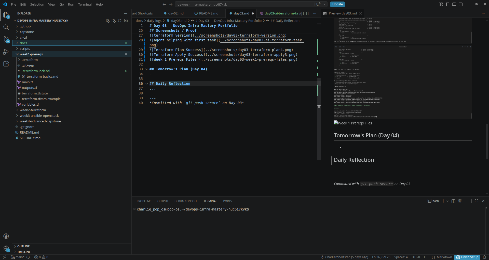

# Day 03 — DevOps Infra Mastery Portfolio

**Date:** April 9, 2026  
**Week:** 1 (Prerequisites & Local AI Setup)  
**Progress:** 3/28 days completed

## What I Accomplished Today
- Installed Terraform, Ansible, and AWS CLI on native Pop!_OS
- Created first clean Terraform configuration using my local AI agent (Qwen)
- Successfully ran `terraform init`, `validate`, `plan`, and `apply`
- Deployed a basic AWS VPC with public + private subnets using Terraform

## Recommended Reading / Listening
Completed AWS Digital course: Job Roles in the Cloud

## Key Learnings
Structuring AWS using Terraform was 

## Challenges & How I Solved Them
Had to troubleshoot and simplify valid Qwen output in order to 

## Recommended Reading / Listening
Documentation and best practices for running local AI using Hermes agent

## Screenshots / Proof
  
  
  
 
   

## Tomorrow's Plan (Day 04)
- 

## Daily Reflection
The volume of information (and side quests) is offering an incredibly rich learning environment. Using Grok primarily to guide through the curriculum has worked out exceptionally well, with the only caveat that I must always beware of rushing through the instructions and always dig deeper. This extends the time needed to complete the content each day, but it's worth it. 

---
*Committed with `git push-secure` on Day 03*