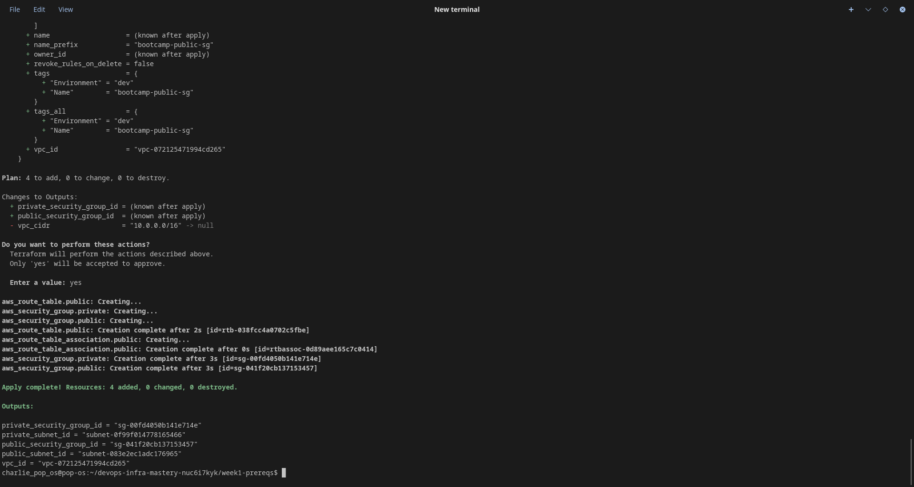
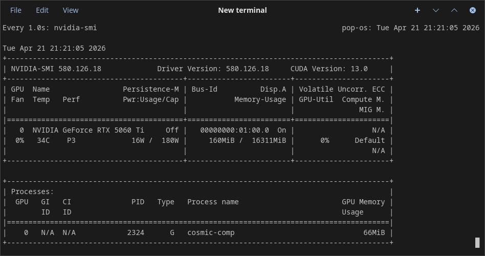
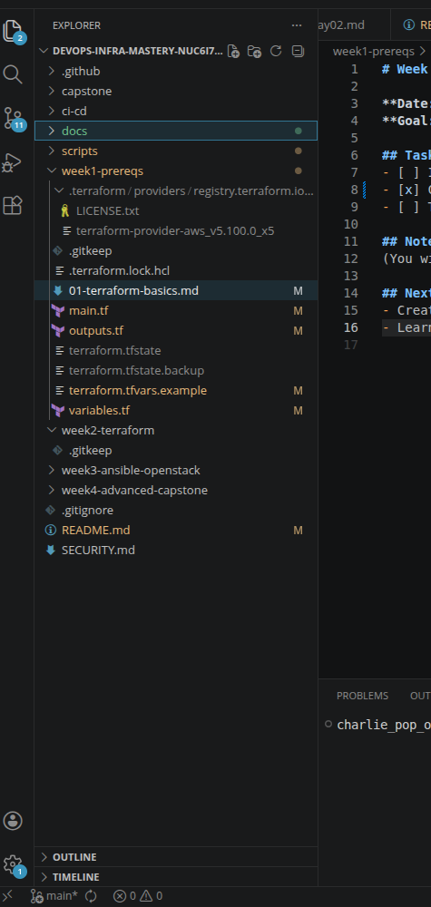

# Day 04 — DevOps Infra Mastery Portfolio

**Date:** April 21, 2026  
**Week:** 1 (Prerequisites & Local AI Setup)  
**Progress:** 4/28 days completed

## What I Accomplished Today
- Enhanced yesterday’s basic VPC with proper routing and security groups
- Used my local AI agent (Hermes) to generate the Terraform configuration
- Successfully ran `terraform plan` and `terraform apply` to add routing + security groups
- Learned how to add Internet Gateway, route tables, and security groups in Terraform
- Cleaned up all resources safely with `terraform destroy` (no lingering costs)

## Key Learnings
- How to make a public subnet reachable from the internet
- Difference between public and private security groups
- The importance of route tables and associations

## Recommended Reading / Listening

- **Complete Terraform Course** – Excellent hands-on video series  
  https://www.youtube.com/watch?v=7xngnjfIlK4
- **The Linux Command Line** by William Shotts (main book)  
  https://linuxcommand.org/tlcl.php
- **Adventures with the Linux Command Line** by William Shotts (sequel)
- **Site Reliability Engineering (SRE Book)** – Free Google book  
  https://sre.google/sre-book/table-of-contents/
- **Terraform Official Tutorials** – HashiCorp’s own guided labs  
  https://developer.hashicorp.com/terraform/tutorials

## Screenshots / Proof

## Tomorrow's Plan (Day 05)
- Begin exploring Terraform modules and state management

## Daily Reflection
I am gaining a much more comprehensive understanding of IaC (infrastructure as code) albeit high level in terms of experience. 

---
*Committed with `git push-secure` on Day 04*