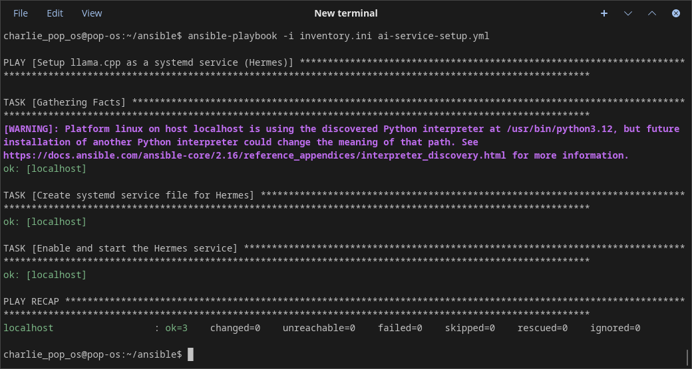
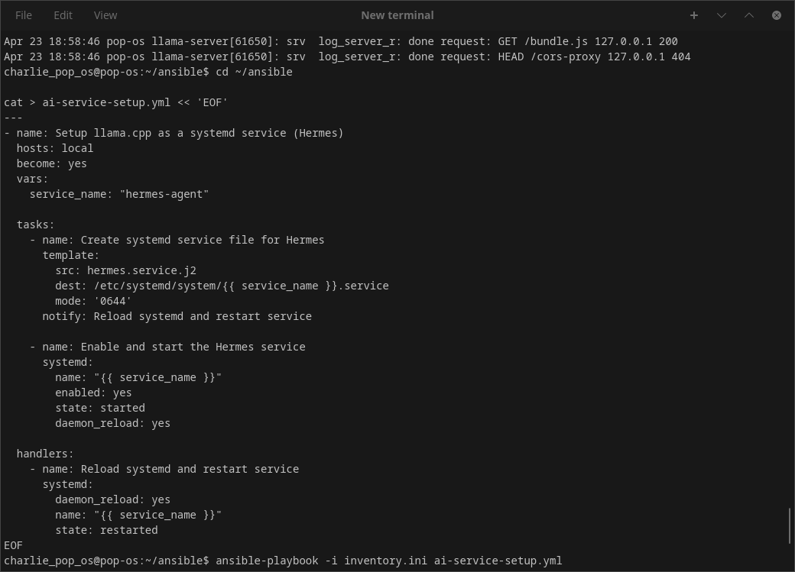
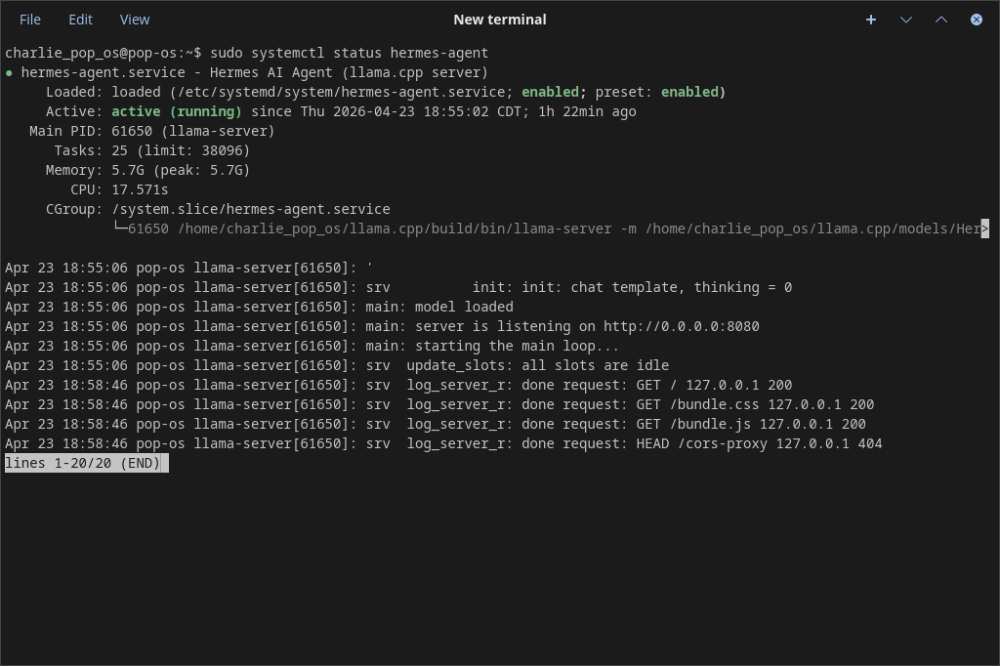
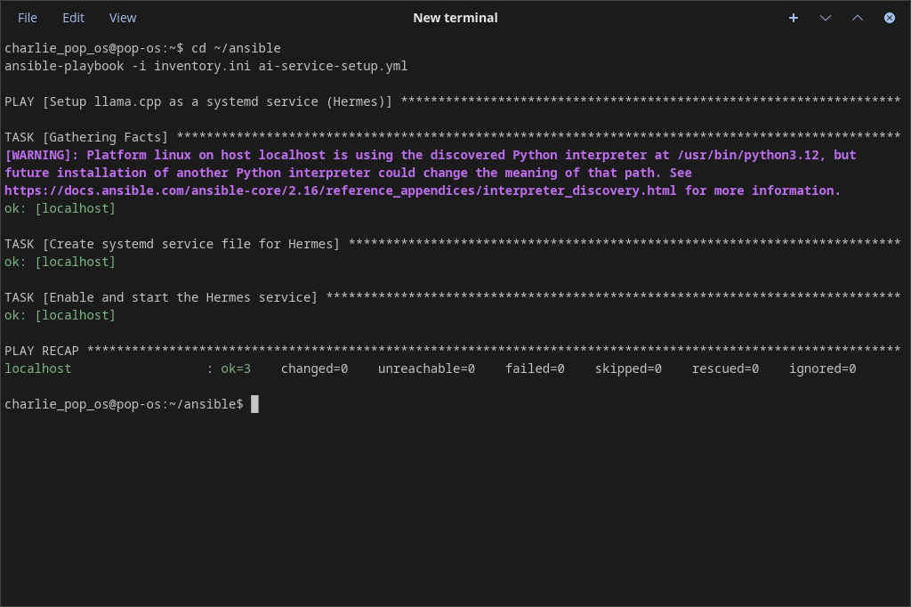

cat > docs/daily-logs/step05.md << 'EOF'
# Step 05 — Ansible Core & Automation

**Date:** April 20, 2026  
**Week:** 1 (Prerequisites & Local AI Setup)  
**Progress:** 5/28 steps completed

## What I Accomplished Today
- Installed Ansible on Pop!_OS and configured passwordless sudo
- Created my first Ansible inventory and basic playbook
- Built a reusable playbook with variables (`devops-setup.yml`)
- Automated local AI stack setup (`ai-stack-setup.yml`)
- Created and deployed a systemd service for Hermes using an Ansible template (`ai-service-setup.yml` + `hermes.service.j2`)
- Made the Hermes agent run as a managed background service that starts on boot

## Key Learnings
- Ansible playbooks are idempotent (safe to run multiple times)
- How to use `become: yes`, variables, and templates
- Proper structure for systemd services managed by Ansible
- The importance of organizing automation code for reusability

## Challenges & How I Solved Them
- Sudo password prompt → Fixed with a dedicated sudoers file
- Template file lookup errors → Learned the correct `templates/` directory convention
- Reserved variable name warning (`port`) → Removed unused variable

## Recommended Reading / Listening
- Official Ansible Documentation – Getting Started  
  https://docs.ansible.com/ansible/latest/getting_started/
- *Ansible for DevOps* by Jeff Geerling (Chapters 1, Appendix A, B)

## Screenshots / Proof

## Tomorrow's Plan (Step 06)
- Learn Ansible Roles (the professional way to organize playbooks)
- Refactor current playbooks into reusable roles

## Daily Reflection
Automated my entire local AI environment with Ansible today. This feels like real DevOps work — turning manual setup into repeatable, version-controlled automation.
EOF